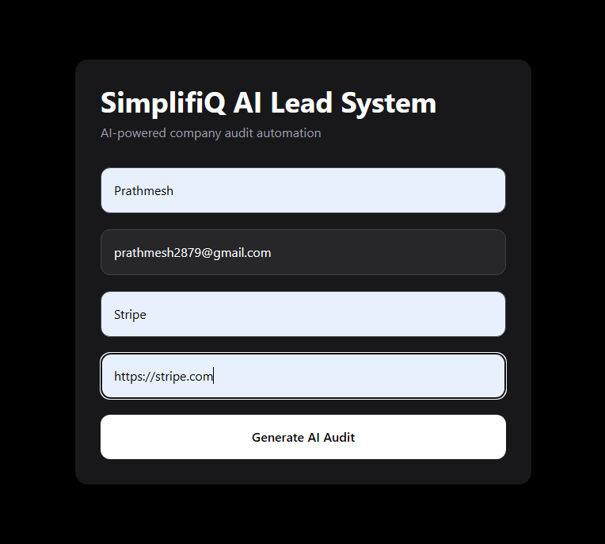
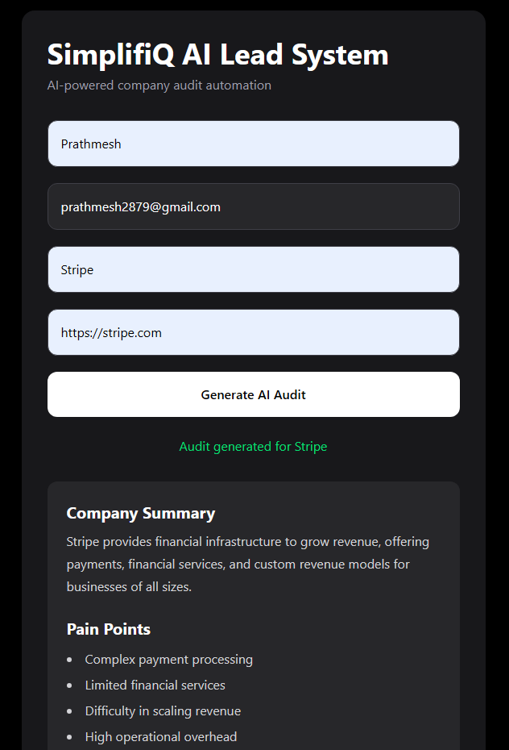
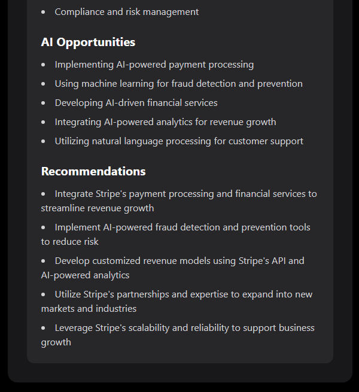
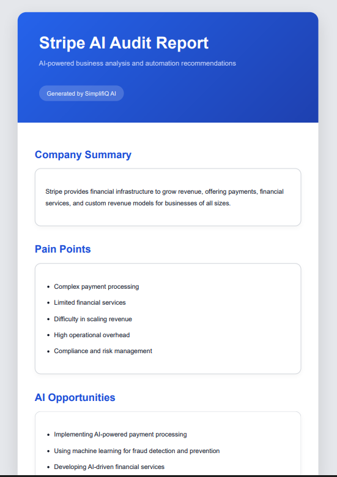
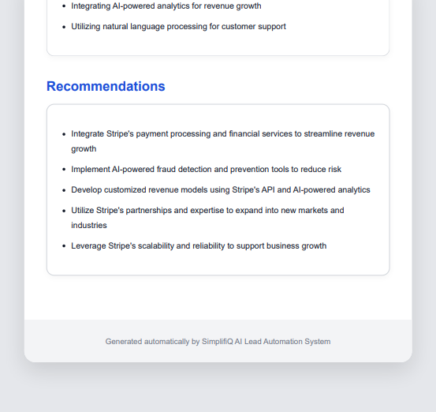
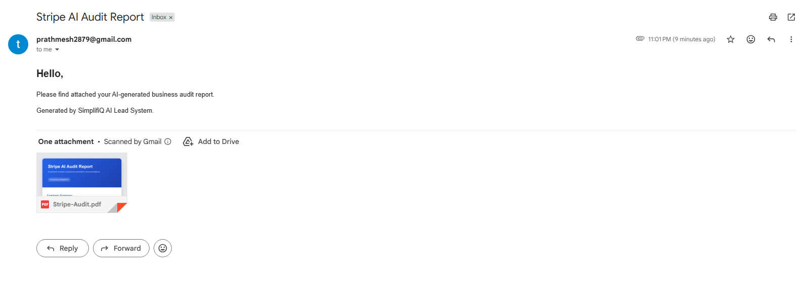
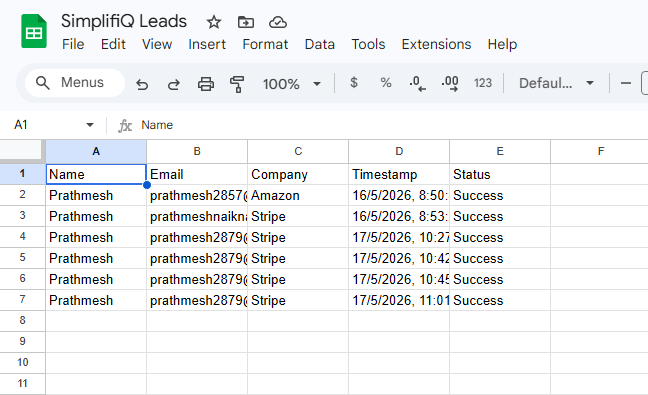

# SimplifiQ AI Lead Automation System

An AI-powered lead enrichment and audit automation platform.

The system automates the complete workflow from lead submission to AI-generated business audit report delivery — scraping the company website, generating a structured AI audit, creating a PDF report, emailing it to the lead, and logging the result to Google Sheets.

**Live demo:** [simplifiq-final.vercel.app](https://simplifiq-final.vercel.app)

---

## Features

- Lead capture form — React + Tailwind CSS
- Input validation with specific error messages (email format, URL format, field lengths)
- Rate limiting — 10 requests per 15 minutes per IP
- Company website scraping with Cheerio (8s timeout, User-Agent header)
- AI-powered business audit via Groq LLM (structured JSON output with shape validation)
- Dynamic PDF report generation with Puppeteer
- Automated email delivery with PDF attachment via Nodemailer
- Google Sheets lead logging via Google Sheets API
- PDF cleanup after email delivery (no disk accumulation)
- Modular service-based backend architecture
- Environment-based configuration (no hardcoded secrets)
- Jest + Supertest test suite (16 tests across 4 files)

---

## Tech Stack

**Frontend:** React, Vite, Tailwind CSS, Axios

**Backend:** Node.js, Express.js, Puppeteer, Nodemailer, Cheerio, Groq API, Google Sheets API

**Testing:** Jest, Supertest

**Deployment:** Vercel (frontend), Render (backend)

---

## System Workflow

```
Lead form submission
       ↓
Input validation (email, URL, length checks)
       ↓
Website scraping (Cheerio + axios)
       ↓
AI audit generation (Groq LLM → structured JSON)
       ↓
HTML report templating
       ↓
PDF generation (Puppeteer)
       ↓
Email delivery with PDF attachment (Nodemailer)
       ↓
PDF cleanup from disk
       ↓
Lead logged to Google Sheets
```

---

## Project Structure

```
client/
  src/
    App.jsx          # Main React component
server/
  services/
    aiService.js     # Groq LLM integration + JSON validation
    scrapeService.js # Website scraping with Cheerio
    pdfService.js    # PDF generation with Puppeteer
    emailService.js  # Email delivery with Nodemailer
    sheetsService.js # Google Sheets logging
  templates/
    reportTemplate.js  # HTML report template
  __tests__/
    aiService.test.js       # 5 unit tests
    scrapeService.test.js   # 4 unit tests
    pdfService.test.js      # 4 unit tests
    validation.test.js      # 5 integration tests (supertest)
  App.js     # Express app (routes, validation, rate limiting)
  index.js   # Server entry point
screenshots/
README.md
RUN_LOCALLY.md
```

---

## Getting Started

See [RUN_LOCALLY.md](./RUN_LOCALLY.md) for full local setup instructions.

```bash
git clone https://github.com/prathmeshcoool/simplifiq-final
```

### Quick start

```bash
# Server
cd server
cp .env.example .env   # fill in your keys
npm install
npm run dev            # runs on port 5000

# Client (new terminal)
cd client
cp .env.example .env
npm install
npm run dev            # opens at localhost:5173

# Tests
cd server
npm test               # 16 tests, no API keys needed
```

---

## Environment Variables

Create `.env` inside `/server`:

```
GROQ_API_KEY=your_groq_api_key
EMAIL_USER=your_gmail_address
EMAIL_PASS=your_gmail_app_password
GOOGLE_SHEET_ID=your_google_sheet_id
PORT=5000
```

Place `google-credentials.json` (Google service account key) inside `/server`.

Create `.env` inside `/client`:

```
VITE_API_URL=http://localhost:5000
```

---

## API Endpoint

### POST `/api/lead`

Request body:

```json
{
  "name": "John Doe",
  "email": "john@example.com",
  "company": "Stripe",
  "website": "https://stripe.com"
}
```

Validation rules:
- All fields required
- `email` must be a valid email format
- `website` must be a valid URL (e.g. `https://...`)
- `name` and `company` must be at least 2 characters

Success response:

```json
{
  "success": true,
  "message": "Audit generated for Stripe",
  "audit": {
    "companySummary": "...",
    "painPoints": ["..."],
    "aiOpportunities": ["..."],
    "recommendations": ["..."]
  }
}
```

---

## Running Tests

```bash
cd server
npm test
```

All tests are fully mocked — no API keys, no network, no browser, no email required.

---

## Engineering Decisions

**Structured AI output** — The AI model is given a system-role prompt enforcing JSON-only output, with a regex fallback to extract JSON even if the model adds surrounding text, and shape validation to ensure all fields are the correct types before reaching the frontend.

**Modular service architecture** — Each concern (scraping, AI, PDF, email, Sheets) is a separate service module, making each independently testable and swappable.

**Environment-based Puppeteer** — On Render (production), `@sparticuz/chromium` + `puppeteer-core` is used (bundled Chromium, no download needed). Locally, regular `puppeteer` is used for a smooth dev experience.

**PDF cleanup** — Generated PDFs are deleted from disk immediately after the email is sent, so files don't accumulate on the server.

**Trust proxy** — `app.set("trust proxy", 1)` is set so `express-rate-limit` correctly identifies clients by IP behind Render's reverse proxy.

---

## Challenges Faced

- Handling malformed AI JSON responses — solved with system-role enforcement, regex extraction, and shape validation
- Puppeteer on Render's free tier — solved by switching to `@sparticuz/chromium` which bundles its own Chromium binary
- Rate limiter `X-Forwarded-For` error on Render — solved by setting `trust proxy`
- Managing async workflow across 5 external services with proper error propagation
- Google credentials on cloud deployment — solved by reading from `GOOGLE_CREDENTIALS_JSON` env var instead of a file

---

## Future Improvements

- Database integration for lead history and audit storage
- Authentication system
- Lead history dashboard
- Google Drive PDF archiving
- CRM integrations (HubSpot, Salesforce)
- AI lead scoring and prioritization
- Multi-page PDF reports

---

## Screenshots

### Lead Form


### Generated Audit



### PDF Report



### Email Delivery


### Google Sheets Logging


---

## Author

Prathmesh Naiknaware
